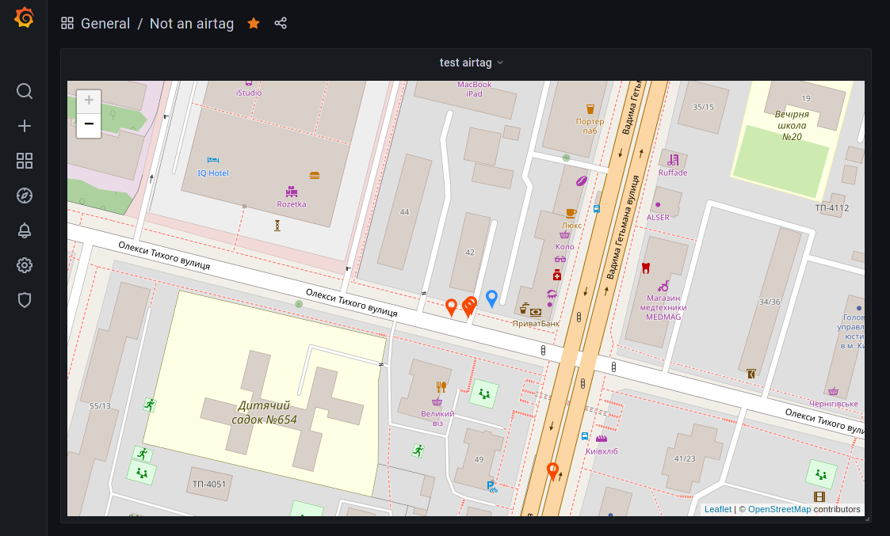

# Openhaystack-python

This python daemon will allow you to gather your Openhaystack-based airtag reports and display them on a Grafana dashboard. \
_You can also use AirTagCrypto.py library alone to decrypt your reports via Python_



## Requirements
- Running [Openhaystack simple-server](https://github.com/Sn0wfreezeDev/openhaystack/tree/simple_server) (I'm using a Big Sur Hackintosh virtual machine on my Proxmox server).
- [Grafana](https://grafana.com/) instance with installed [Track map](https://github.com/alexandrainst/alexandra-trackmap-panel) plugin (in my case running on a separate Arch Linux machine with InfluxDB). 
- [InfluxDB 2.0](https://www.influxdata.com/) to store your decrypted reports and send them to Grafana.

## Installation
To run a daemon you'll need to:
- Create a python venv and install necessary libraries:
```shell
cd daemon
python3 -m venv venv
source venv/bin/activate
python3 -m pip install -r requirements.txt
```
- Edit your config.py to fill your InfluxDB credentials, simple_server URL, and put your tokens' private key in there (you can get them by exporting your accessories in an OpenHaystack app and copying privateKeys from there).
- Edit systemd/airtags.service so that your path to "airtags" directory matches your actual path
- Copy airtags.service and airtags.timer to /etc/systemd/system/ and run `sudo systemctl enable --now airtags.timer`

Now the daemon should be working and your InfluxDB must be filled with reports.
\
\
\
To link your InfluxDB with Prometheus you'll need to create a new empty panel, change its type to "Track map", select your InfluxDB as a data source, and create a query like that:
```
from(bucket: "airtags")
  |> range(start: v.timeRangeStart, stop: v.timeRangeStop)
  |> filter(fn: (r) => r["_measurement"] == "YOUR_TAG_ID")
  |> filter(fn: (r) => r["_field"] == "latitude" or r["_field"] == "longitude" or r["_field"] == "tooltip")

  |> pivot(columnKey: ["_field"], rowKey: ["_time"], valueColumn: "_value")
  |> duplicate(column: "latitude", as: "lat")
  |> duplicate(column: "longitude", as: "lon")
  |> keep(columns: ["_time", "popup", "tooltip", "lat", "lon"])
```
You can find your tag's id in OpenHaystack app by right-clicking your tag and selecting "Copy advertisement key (Base64)". Also, there's a grafana/dashboard.json example dashboard that you can use.
